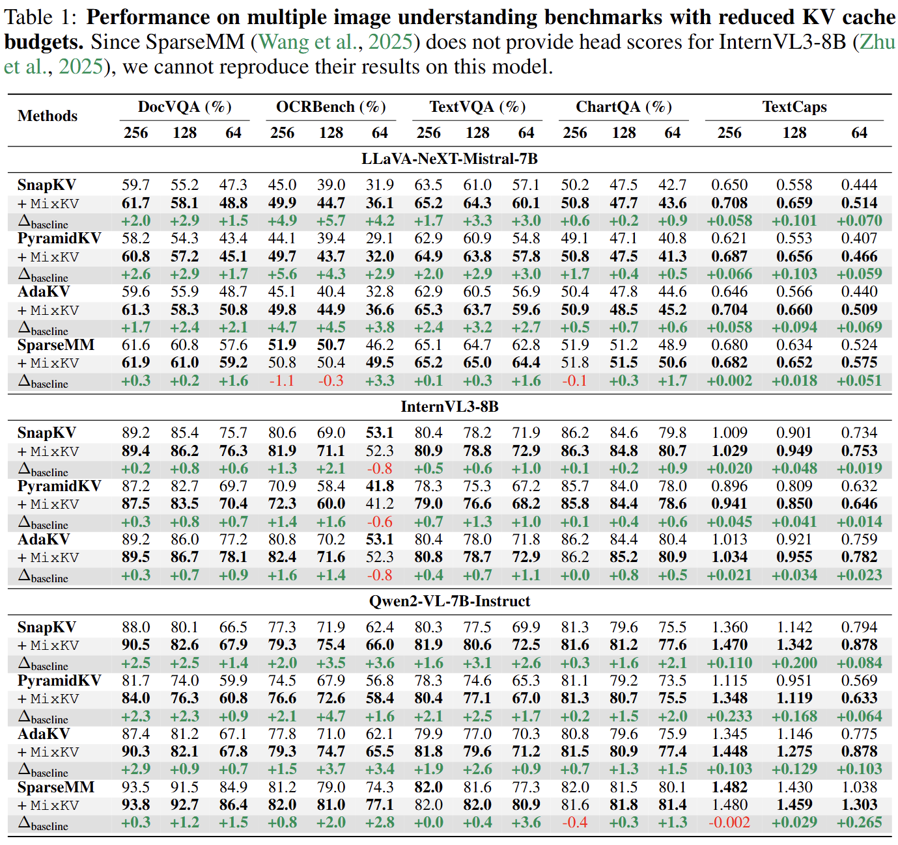
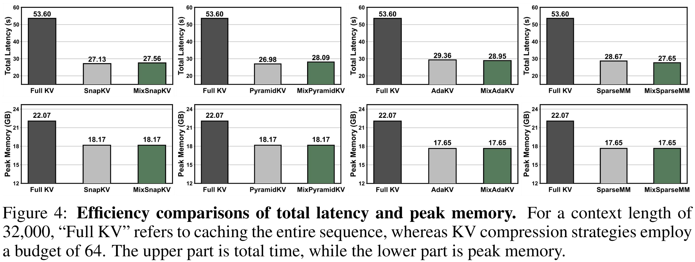

<div align=center>
<h1> 🚀 Mixing Importance with Diversity: Joint Optimization for KV Cache Compression in Large Vision-Language Models </h1>
<h4 align="center"> 

[Xuyang Liu](https://xuyang-liu16.github.io/)<sup>1,2*</sup>,
Xiyan Gui<sup>3*</sup>,
Yuchao Zhang<sup>1</sup>,
[Linfeng Zhang](http://www.zhanglinfeng.tech/)<sup>1✉</sup>

<sup>1</sup>EPIC Lab, Shanghai Jiao Tong University, <sup>2</sup>Sichuan University, <sup>3</sup>Huazhong University of Science and Technology

</h4>

</div>

## 🔥 News

* **`2025.10.24`** 🤗🤗 We release our latest work [MixKV](https://github.com/xuyang-liu16/MixKV), a novel KV cache compression method of LVLMs. [Code](https://github.com/xuyang-liu16/MixKV) is available!

## 🛠 Preparation

1. Clone this repository:
```bash 
git clone https://github.com/xuyang-liu16/MixKV.git
cd MixKV
```

2. Init your environment
```bash
conda create -n mixkv python=3.10 -y
conda activate mixkv
```

3. Install packages

Compile CUDA code for Flatten Cache Storage. If you encounter a CUDA compile error, please check your [GPU Virtual Architecture](https://docs.nvidia.com/cuda/cuda-compiler-driver-nvcc/index.html#virtual-architecture-feature-list) and [GPU Feature](https://docs.nvidia.com/cuda/cuda-compiler-driver-nvcc/index.html#gpu-feature-list), then change the corresponding compile flag in [csrc/build.py](https://github.com/xuyang-liu16/MixKV/blob/main/csrc/build.py#L20)
```bash
pip install packaging torch==2.5.1
pip uninstall ninja && pip cache purge && pip install ninja --no-cache-dir
cd csrc && make
cd ..
```

Install other packages
```bash
pip install -e .
pip install flash-attn==2.4.1 --no-build-isolation # currently only support FlashAttention
pip install qwen-vl-utils
```

4. Install lmms-eval for evaluation

We use the [lmms-eval](https://github.com/EvolvingLMMs-Lab/lmms-eval) toolkit to evaluate all methods and models. Please install lmms-eval:

```bash
cd lmms-eval
pip install -e . 
```
## 🚀 Performance Evaluation

<p align="center">  </p>

To evaluate LLaVA-NeXT-Mistral-7B, InternVL3-8B, and Qwen2-VL-7B, you can use:

```bash
bash scripts/eval/mistral.sh
bash scripts/eval/internvl2.sh
bash scripts/eval/qwen.sh
```

## ⚡ Efficiency Analysis

<p align="center">  </p>

To evaluate the latency and peak memory by different settings, you can use:

```bash
bash scripts/others/speed_and_memory.sh
```

## 👍 Acknowledgment

Our codebase is conducted on [SparseMM](https://github.com/CR400AF-A/SparseMM) and we extend our gratitude to the open-source efforts.
